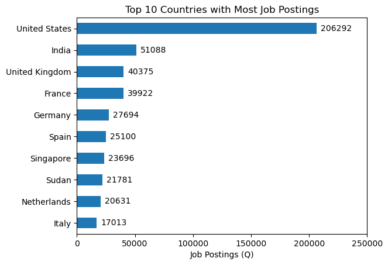

# Project Overview
In this project, I’ll be analyzing the current data job market, specifically focusing on data analyst positions. My goal is to gain a deeper understanding of the job landscape and identify the most valuable skills in demand, as well as the highest-paying opportunities.

The analysis is based on this [database](https://huggingface.co/datasets/lukebarousse/data_jobs) created by [Luke Barousee](https://github.com/lukebarousse), which serves as a foundation for exploring various job titles, salary ranges, locations, and essential skill sets. Using Python, I dig into key topics such as which skills are most sought-after, salary patterns, and how the demand for skills correlates with salary growth in data analytics.

## Key Questions
Throughout this project, I aim to answer the following questions:

**1.** What skills are most highly sought after for the leading data roles?

**2.** How are the most in-demand skills for Data Analysts evolving over time?

**3.** How well do the salaries match the skills required for Data Analysts?

**4.** Which skills offer the best combination of high demand and high pay for Data Analysts?

## Tools Used
To conduct my in-depth analysis of the data analyst job market, I relied on several powerful tools to guide my process:

- **Python**: The core tool that powered my analysis, helping me process and extract valuable insights from the data.

- **Pandas**: This Python library was essential for manipulating and analyzing the data.

- **Matplotlib**: Used for creating basic visualizations to help understand the data better.

- **Seaborn**: A more advanced visualization library, used to create more polished and insightful charts.

- **Jupyter Notebooks**: The platform where I ran my Python scripts, providing a convenient space for coding, documenting, and analyzing in one place.

- **Visual Studio Code**: My preferred editor for writing and executing Python code.

- **Git & GitHub**: Vital tools for version control, enabling me to track changes in my code and easily share my work with others.

## Previous Data Preparation and Cleanup
In order to get the expected results from this database, we need to take into account some considerations to easier the data processing.

### Import and Clean Data
I began by importing the necessary libraries that I’ll need later, followed by cleaning the data to ensure there are no errors down the line.

```python
# Importing Libraries
import ast
import pandas as pd
from datasets import load_dataset
import matplotlib.pyplot as plt
import seaborn as sns

# Loading Data
dataset = load_dataset('lukebarousse/data_jobs')
df = dataset['train'].to_pandas()

# Data Cleanup
df['job_posted_date'] = pd.to_datetime(df['job_posted_date'])
df['job_skills'] = df['job_skills'].apply(lambda x: ast.literal_eval(x) if pd.notna(x) else x)
```

### Consideration
I decided to work only with US data since it has the most available information for analytics.

You can check full code [here](1_Intro.ipynb).

