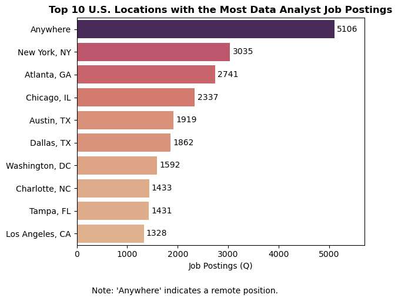
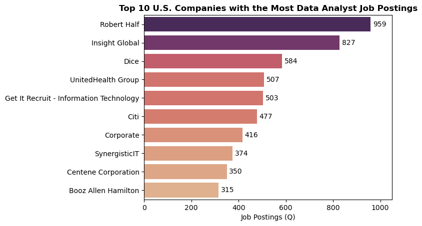
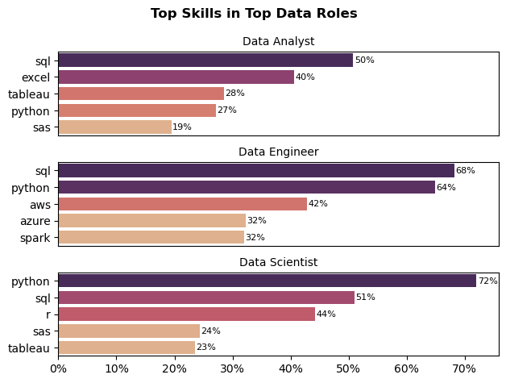
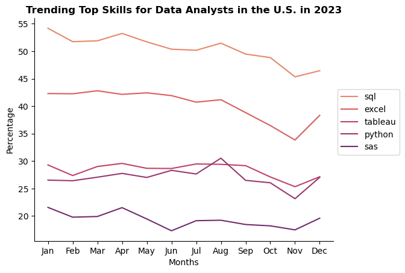
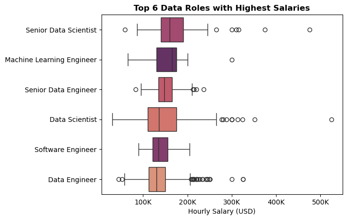
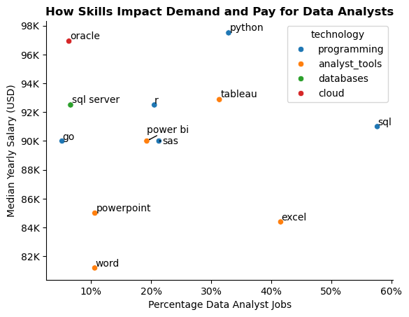

# Project Overview
In this project, I’ll be analyzing the current data job market, specifically focusing on data analyst positions. My goal is to gain a deeper understanding of the job landscape and identify the most valuable skills in demand, as well as the highest-paying opportunities.

The analysis is based on this [database](https://huggingface.co/datasets/lukebarousse/data_jobs) created by [Luke Barousee](https://github.com/lukebarousse), which serves as a foundation for exploring various job titles, salary ranges, locations, and essential skill sets. Using Python, I dig into key topics such as which skills are most sought-after, salary patterns, and how the demand for skills correlates with salary growth in data analytics.

## Tools Used
To conduct my in-depth analysis of the data analyst job market, I relied on several powerful tools to guide my process:

- **Python**: The core tool that powered my analysis, helping me process and extract valuable insights from the data.

- **Pandas**: This Python library was essential for manipulating and analyzing the data.

- **Matplotlib**: Used for creating basic visualizations to help understand the data better.

- **Seaborn**: A more advanced visualization library, used to create more polished and insightful charts.

- **Jupyter Notebooks**: The platform where I ran my Python scripts, providing a convenient space for coding, documenting, and analyzing in one place.

- **Visual Studio Code**: My preferred editor for writing and executing Python code.

- **Git & GitHub**: Vital tools for version control, enabling me to track changes in my code and easily share my work with others.

## Previous Data Preparation and Cleanup
In order to get the expected results from this database, we need to take into account some considerations to easier the data processing.

### Import and Clean Data
I began by importing the necessary libraries that I’ll need later, followed by cleaning the data to ensure there are no errors down the line.

```python
# Importing Libraries
import ast
import pandas as pd
from datasets import load_dataset
import matplotlib.pyplot as plt
import seaborn as sns

# Loading Data
dataset = load_dataset('lukebarousse/data_jobs')
df = dataset['train'].to_pandas()

# Data Cleanup
df['job_posted_date'] = pd.to_datetime(df['job_posted_date'])
df['job_skills'] = df['job_skills'].apply(lambda x: ast.literal_eval(x) if pd.notna(x) else x)
```

### Consideration
I decided to work only with US data since it has the most available information for analytics.

You can check full code [here](1_Consideration.ipynb).


## Exploratory Analysis

I selected the Data Analyst role just for demonstration purposes, to use it as a point of comparison for upcoming analyses.

Check full code here [here](2_EDA.ipynb).

### Top U.S. Locations Filtered by Postings Count

It’s important to highlight that, although the U.S. has the highest number of job postings worldwide according to this database, not all locations show the same high demand for this role. Here, you'll find the places with the highest demand.



### Benefits

It's normal to expect extra perks to make positions more attractive, just as it's expected that candidates meet certain requirements. There are various reasons why these expectations are not always met, which are beyond the scope of this project, but in any case, here are the relevant statistics.


### Most Relevant Companies

You can find great opportunities at a startup, but if you're looking to really challenge yourself, consider a big company where you’ll likely work with large databases and complex tasks.



## Key Questions
Throughout this project, I aim to answer the following questions:

**1.** [What skills are most highly sought after for the leading data roles?](#1-what-skills-are-most-highly-sought-after-for-the-leading-data-roles)

**2.** [How are the most in-demand skills for Data Analysts evolving over time?](#2-how-are-the-most-in-demand-skills-for-data-analysts-evolving-over-time)

**3.** [How do data career paths progress from a Data Analyst role?](#3-how-do-data-career-paths-progress-from-a-data-analyst-role)

**4.** [Which skills offer the best combination of high demand and high pay for Data Analysts?](#4-which-skills-offer-the-best-combination-of-high-demand-and-high-pay-for-data-analysts)


# Analysis
## 1. What skills are most highly sought after for the leading data roles?

I identified the top 3 most popular data roles and analyzed the 5 most in-demand skills for each. This highlights the key skills to focus on based on the role you're targeting.

Check full code [here](./3_Skill_Demand.ipynb).



### Insights

- **SQL** is crucial across all roles, especially for **Data Engineers (68%)**, as they work extensively with databases. **Data Analysts (50%)** and **Data Scientists (51%)** also rely on it for querying and data manipulation.

- **Python** dominates in **Data Science (72%)** and **Data Engineering (64%)**, reflecting its importance in machine learning, automation, and data processing. **Data Analysts (27%)** use it less, as their work often involves tools like Excel.

- Data **Analysts** focus on **Excel** (40%) and **Tableau** (28%), highlighting their emphasis on data visualization, reporting, and business intelligence.

- Data **Engineers** require expertise in **AWS** (42%), **Azure** (32%), and **Spark** (32%), as they work with cloud platforms and distributed computing for handling large-scale data.

- Data **Scientists** frequently use **R** (44%) and **SAS** (24%), indicating the need for statistical and analytical tools alongside **Python** for advanced data modeling.

## 2. How are the most in-demand skills for Data Analysts evolving over time?

I wanted to take a closer look at the Data Analyst role by reviewing which skills are trendin, seeing which ones are becoming outdated and which are steadily rising.

Check full code [here](4_Most_In_Demand_Skills.ipynb)



### Insights

- SQL remains the most in-demand skill throughout the year, with percentages hovering between 45% and 55%. There is a noticeable dip towards the end of the year, but it still leads.

- Excel maintains a relatively stable demand, ranging around 40-42%, before experiencing a decline in the last quarter of the year. However, there is an uptick in December.

- Tableau and Python show fluctuations in demand. Tableau starts higher but declines toward the end of the year. Python, on the other hand, peaks around August and remains steady.

- Among the listed skills, SAS has the lowest percentage, staying below 25%. It appears to decline mid-year before slightly recovering in December.

- While SQL and Excel decline toward the end of the year, there is a sudden rise in December, possibly due to new hiring cycles or skill shifts.

## 3. How do data career paths progress from a Data Analyst role?

If you’re not familiar with data jobs, you might think Analyst is the only role in the field. In reality, it’s just the entry point to the Data and AI space. Since salary is a key factor when choosing a data career path, here are the highest-paying data roles.

Check full code [here](5_Salaries.ipynb).



### Insights

- **Senior Data Scientist** has one of the **highest median salaries**, with a wide interquartile range, indicating significant variation in pay. Several high outliers suggest that top professionals in this role earn exceptionally well.

- **Machine Learning Engineers** also command high salaries, with a **strong median** and a relatively compact range. The presence of a few extreme outliers suggests that specialized expertise can lead to exceptionally high earnings.

- **Senior Data Engineers** have a slightly lower median salary than Senior Data Scientists and ML Engineers but still earn well. Their **salary** distribution is **fairly spread out**, showing variations based on experience and industry.

- **Data Scientists** display a broad salary distribution, with a large interquartile range and many high outliers. This suggests that while some Data Scientists earn moderate salaries, others especially those in specialized fields **achieve significantly higher compensation**.

- **Software Engineers** have a narrower **salary** range compared to other data roles,**with a lower median**. While some high outliers exist, salaries in this role appear to be more stable and predictable.

- **Data Engineers** have the **lowest median salary** among the six roles, with a wide distribution. The presence of numerous outliers suggests that while entry-level salaries might be lower, experienced professionals can earn significantly more.

## 4. Which skills offer the best combination of high demand and high pay for Data Analysts?
Once we've chosen the right learning path, the next question is which tools and software we need to learn. This is important because they will serve as our foundation on this journey. This chart highlights the most in-demand and highest-paying tools/softwares, making it a great starting point.

Check full code [here](6_Optimal_skills.ipynb).



### Insights
- **SQL** is the **most in-demand skill** (appearing in nearly 60% of job postings) and offers a competitive median salary (~$90K). Its widespread use in querying and managing databases makes it a fundamental requirement for Data Analysts.

- **Python** commands the **highest median salary** (~$98K) despite being required in fewer jobs (~30%). This suggests that Data Analysts proficient in Python can access higher-paying roles, likely due to its use in automation, machine learning, and advanced analytics.

- **Tableau** and **Power BI** are **valuable analyst tools**, with Tableau offering a slightly higher salary ($92K) than Power BI ($90K). Their demand (~30% for Tableau and ~20% for Power BI) highlights their importance in data visualization and business intelligence.

- **Excel** is highly demanded (45%) but **pays the least** ($84K), indicating that while it is a widely used tool, it is more common in entry-level or lower-paying Data Analyst roles.

- **Databases** like SQL Server (~15%) and Oracle (10%) offer **strong salaries** ($92K–$97K), reflecting their importance in managing structured data in enterprise settings.

- **Cloud-related** skills (Oracle) and **advanced programming** (Go, R, SAS) correlate with **higher salaries** (~$90K–$97K) but are **less** commonly **required** (~10%–20% of job postings). These specialized skills can lead to niche, well-compensated roles.

# Challenges Faced
- **Data Inconsistencies:** Ensuring the imported data is free of incompatible values that could lead to unreliable results.

- **Complex Data Visualization:** Ensuring the labels and plot type are clear and best suited for the data.

- **Data Preparation:** Handling dictionary values as column entries, managing them carefully, and creating fallback points in case of errors, ensuring they’re ready for calculations.

# Conclusion
This project highlighted key insights into the data analyst job market, focusing on in-demand skills like SQL, Python, and Tableau, and their correlation with salary growth. It emphasized the importance of continuous learning to stay competitive, as career paths evolve from entry-level roles to higher-paying positions like Senior Data Scientist. Understanding the tools and skills that drive success in this field can help professionals make informed career decisions. By aligning skills with market demands, data professionals can unlock better opportunities and higher earnings.